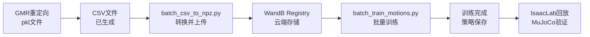

# GMR → IsaacLab训练完整方案

## 📋 方案概览

本方案提供从GMR运动重定向结果到IsaacLab强化学习训练的完整流程,包括:

1. **数据转换**: PKL → CSV → NPZ
2. **WandB集成**: 自动上传到Registry
3. **批量训练**: 多动作并行训练
4. **结果评估**: WandB可视化

## 🗂️ 文件组织

```
GMR/
├── pkl_files/                    # GMR输出数据
│   ├── walk_amass.pkl           # 原始重定向结果
│   ├── turn_amass.pkl
│   ├── stand_g1.pkl
│   └── csv/                     # CSV格式(已生成)
│       ├── stand_g1.csv         ✓ 已有
│       └── [其他动作.csv]       # 待生成
│
├── programs/                    # 训练辅助脚本
│   ├── batch_csv_to_npz.py     # CSV→NPZ批量转换
│   ├── batch_train_motions.py  # 批量训练脚本
│   └── check_wandb_registry.py # Registry检查工具
│
└── docs/                        # 完整文档
    ├── 训练快速开始.md          # 5分钟快速指南 ⭐
    ├── whole_body_tracking训练指南.md  # 完整教程
    ├── WandB配置指南.md         # WandB设置
    └── 训练方案总览.md          # 本文档
```

## 🚀 核心工作流



## 📝 操作步骤(完整版)

### 前置准备

#### 1. 环境检查
```bash
# 检查GMR输出
ls /home/abc/GMR/pkl_files/csv/
# 应该看到: stand_g1.csv 等文件

# 检查whole_body_tracking
ls /home/abc/whole_body_tracking/scripts/csv_to_npz.py
# 应该存在

# 检查IsaacLab环境
conda env list | grep isaaclab
```

#### 2. WandB配置
```bash
# 登录WandB
wandb login
# 输入API key: https://wandb.ai/authorize

# 创建Registry集合(网页端操作)
# 1. 访问 https://wandb.ai/
# 2. Core → Registry → New Collection
# 3. Name: Motions, Type: All Types
```

### 主要流程

#### Step 1: 批量转换CSV到NPZ
```bash
cd /home/abc/GMR

# 完整转换(推荐)
python programs/batch_csv_to_npz.py \
    --wandb-org your-username \
    --headless

# 测试单个文件
python programs/batch_csv_to_npz.py \
    --wandb-org your-username \
    --filter "stand*" \
    --headless

# 查看帮助
python programs/batch_csv_to_npz.py --help
```

**预计时间**: 
- 单个动作: 1-2分钟
- 全部动作(7个): 10-15分钟

#### Step 2: 验证上传
```bash
# 检查Registry中的动作
python programs/check_wandb_registry.py --wandb-org your-username

# 回放测试
cd /home/abc/whole_body_tracking
python scripts/replay_npz.py \
    --registry_name=your-username-org/wandb-registry-motions/stand_g1
```

#### Step 3: 批量训练
```bash
cd /home/abc/GMR

# 训练所有动作(默认配置)
python programs/batch_train_motions.py \
    --wandb-org your-username

# 训练特定动作
python programs/batch_train_motions.py \
    --wandb-org your-username \
    --motions stand_g1 walk_amass turn_amass

# 自定义参数
python programs/batch_train_motions.py \
    --wandb-org your-username \
    --motions walk_amass \
    --max-iterations 2000 \
    --num-envs 8192
```

**预计时间**(每个动作):
- stand (500次): ~1小时
- walk/turn (1000次): ~2小时
- crouch (1500次): ~3小时
- dance (2000次): ~5小时

#### Step 4: 查看结果
```bash
# 访问WandB项目
# https://wandb.ai/your-username/GMR-MotionTracking

# IsaacLab中回放
cd /home/abc/whole_body_tracking
python scripts/rsl_rl/play.py \
    --task=G1-Flat \
    --checkpoint=/path/to/checkpoint
```

## 🎯 推荐配置

### 硬件要求

| 组件 | 最低要求 | 推荐配置 |
|------|---------|---------|
| GPU | RTX 3060 (12GB) | RTX 3090/4090 (24GB) |
| CPU | 8核 | 16核+ |
| RAM | 16GB | 32GB+ |
| 存储 | 50GB | 100GB+ SSD |

### 训练参数建议

| 动作类型 | num_envs | max_iterations | GPU显存 | 预计时间 |
|---------|----------|----------------|---------|---------|
| 简单(stand) | 4096 | 500 | ~18GB | 1小时 |
| 中等(walk/turn) | 4096 | 1000 | ~18GB | 2小时 |
| 复杂(crouch) | 4096 | 1500 | ~18GB | 3小时 |
| 高难(dance) | 8192 | 2000 | ~22GB | 5小时 |

**GPU显存不足时的调整**:
```bash
--num-envs=2048  # 从4096降到2048(显存减半)
```

## 🔧 脚本详解

### 1. batch_csv_to_npz.py

**功能**: 批量将CSV转换为NPZ并上传WandB

**核心参数**:
```bash
--wandb-org       # WandB用户名(必需)
--input-fps 30    # GMR输出帧率
--output-fps 50   # IsaacLab使用帧率
--headless        # 无UI模式
--filter "walk*"  # 过滤文件名
--dry-run         # 测试模式
```

**内部流程**:
1. 扫描 `pkl_files/csv/` 目录
2. 检查CSV格式(36列)
3. 调用 `whole_body_tracking/scripts/csv_to_npz.py`
4. 自动上传到WandB Registry
5. 生成转换报告

### 2. batch_train_motions.py

**功能**: 批量训练多个动作

**核心参数**:
```bash
--wandb-org              # WandB用户名(必需)
--motions stand walk     # 指定训练动作
--task G1-Flat           # IsaacLab任务
--num-envs 4096          # 并行环境数
--max-iterations 1000    # 训练次数
--wandb-project NAME     # WandB项目名
--continue-on-failure    # 失败后继续
--dry-run               # 测试模式
```

**内置配置** (在脚本中的 `MOTION_CONFIGS`):
```python
"walk_amass": {
    "num_envs": 4096,
    "max_iterations": 1000,
    "description": "行走动作"
}
```

### 3. check_wandb_registry.py

**功能**: 检查WandB Registry中的动作列表

**输出示例**:
```
序号  动作名                            版本      大小       创建时间
----------------------------------------------------------------------------------
1     stand_g1                         v0        2.3 MB    2026-01-29 10:30:00
2     walk_amass                       v0        5.1 MB    2026-01-29 10:32:00
3     turn_amass                       v0        4.8 MB    2026-01-29 10:34:00
```

## 📊 训练监控

### WandB指标

训练过程中自动记录:

1. **奖励曲线**
   - Total Reward
   - Task Reward (动作跟踪)
   - Regularization Penalties

2. **性能指标**
   - Joint Position Error
   - Root Position Error
   - Success Rate

3. **系统指标**
   - FPS (训练速度)
   - GPU Memory
   - Episode Length

### 访问方式
```
https://wandb.ai/<your-username>/GMR-MotionTracking
```

## 🐛 故障排查

### 常见问题

#### 1. CSV文件不存在
```bash
# 问题: pkl_files/csv/ 目录为空
# 解决: 需要GMR先生成CSV
# (当前只有stand_g1.csv)
```

#### 2. WandB上传失败
```bash
# 检查网络
ping api.wandb.ai

# 重新登录
wandb login --relogin

# 检查API
python -c "import wandb; api = wandb.Api(); print('OK')"
```

#### 3. GPU内存不足
```bash
# 降低并行环境数
--num-envs=2048  # 或 1024
```

#### 4. Registry找不到动作
```bash
# 检查路径格式
# 正确: username-org/wandb-registry-motions/motion_name:latest
# 错误: username/wandb-registry-motions/motion_name

# 列出所有动作
python programs/check_wandb_registry.py --wandb-org your-username
```

## 📈 性能优化

### 训练加速

1. **增加并行环境**
   ```bash
   --num-envs=8192  # 如果GPU显存充足
   ```

2. **使用多GPU**
   ```bash
   # IsaacLab支持多GPU,修改配置文件
   # 或使用 CUDA_VISIBLE_DEVICES
   CUDA_VISIBLE_DEVICES=0,1 python ...
   ```

3. **优化网络**
   ```bash
   # 使用本地存储的NPZ,避免每次从WandB下载
   # 首次运行后文件会缓存在 ~/.cache/wandb
   ```

### 数据质量优化

1. **GMR平滑滤波**
   - 使用 `programs/trajectory_smoother.py`
   - 推荐: `smooth_upper_body(torso_sigma=2.0, arm_sigma=1.5)`

2. **动作裁剪**
   ```bash
   # 只使用动作的关键部分
   --frame_range 100 500  # 在csv_to_npz时指定
   ```

## 🎓 进阶使用

### 自定义任务配置

修改 `whole_body_tracking/source/.../tasks/` 中的配置:

```python
# 调整奖励权重
tracking_weight = 1.0
velocity_weight = 0.1
torque_weight = 0.01
```

### 多动作联合训练

```python
# 在一次训练中使用多个动作
# 修改配置文件,支持动作切换
```

### 真机部署准备

1. 导出训练好的策略
2. 在MuJoCo中验证
3. 转换为机器人控制格式
4. 真机测试(返校后)

## 📚 相关文档

### 本项目文档
- [训练快速开始.md](训练快速开始.md) - 5分钟上手 ⭐
- [whole_body_tracking训练指南.md](whole_body_tracking训练指南.md) - 完整教程
- [WandB配置指南.md](WandB配置指南.md) - WandB详细配置

### 项目文档
- [GMR/CLAUDE.md](../CLAUDE.md) - GMR项目说明
- [GMR/.github/copilot-instructions.md](../.github/copilot-instructions.md) - 毕业设计指导

### 外部文档
- [IsaacLab文档](https://isaac-sim.github.io/IsaacLab)
- [BeyondMimic论文](https://arxiv.org/abs/2508.08241)
- [WandB文档](https://docs.wandb.ai/)

## ✅ 检查清单

### 开始训练前
- [ ] GMR已生成CSV文件
- [ ] WandB已登录并创建Registry
- [ ] IsaacLab环境已激活
- [ ] GPU驱动正常
- [ ] 磁盘空间充足(>50GB)

### 训练过程中
- [ ] WandB实时显示训练曲线
- [ ] GPU使用率正常(>80%)
- [ ] 无内存溢出错误
- [ ] Checkpoint正常保存

### 训练完成后
- [ ] 查看WandB完整报告
- [ ] IsaacLab回放测试
- [ ] MuJoCo仿真验证
- [ ] 对比GMR评估结果

## 🎯 后续计划

1. **训练阶段** (当前)
   - 完成所有基础动作训练
   - 评估训练效果
   - 参数调优

2. **验证阶段** (2月)
   - IsaacLab仿真验证
   - MuJoCo稳定性测试
   - 与GMR评估对比

3. **部署阶段** (3月返校后)
   - 真机简单动作(stand/walk)
   - 真机复杂动作(turn/dance)
   - 最终效果评估

## 📞 获取帮助

遇到问题时:

1. 查看本方案的文档
2. 检查故障排查章节
3. 查看IsaacLab官方文档
4. 查看WandB社区
5. 参考GMR项目文档

---

**最后更新**: 2026-01-29  
**版本**: v1.0  
**作者**: 毕业设计助手
